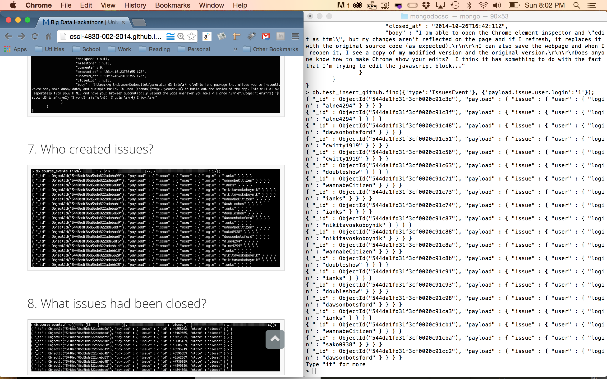
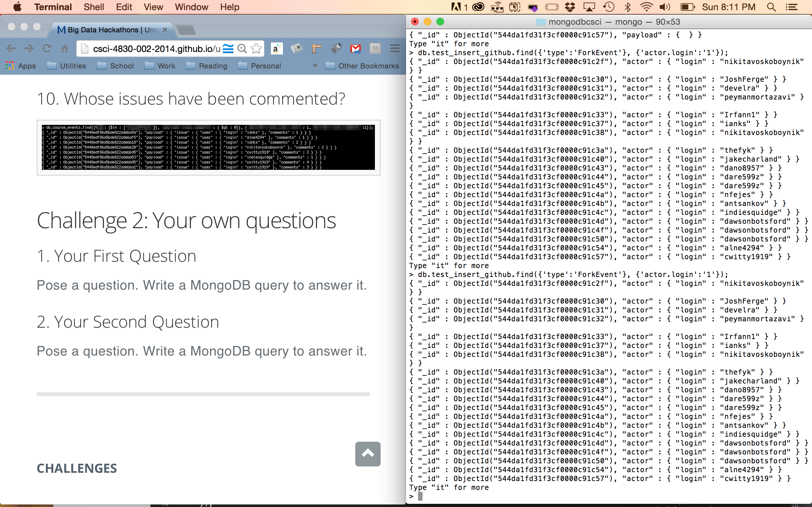

# Name

Michael Fyk

# How many points have you earned?

98/100

(Make your own calculation and replace the number 0 with the points you think you've earned.)

# How many hours have you spent on this?

8

# When did you first start working on this week's learning challenges?

Saturday morning.

# What is the most difficult part about this week's challenge?

Reconfiguring MongoDB.

# Show and tell (8 points)

## Link (2 points)

[Security Threats To Wall Street -- And The Big Data Solution](http://www.forbes.com/sites/groupthink/2014/10/08/security-threats-to-wall-street-and-the-big-data-solution/)

## Discuss how you may apply the machine learning technique mentioned in this article to another interesting problem (6 points).

If the algorithms work for detecting fraud in banks, there can also be similar techniques used for protecting a web app from malicious behavior.

# D3 IV

## Checkpoints (3 points x 4 = 12 points)

# 1. (3 points)

[checkpoint](Ch1.html)

# 2. (3 points)

[checkpoint](Ch2.html)

# 3. (3 points)

[checkpoint](Ch3.html)

# 4. (3 points)

[checkpoint](Ch4.html)

## Challenges (4 points x 3 = 12 points)

# 1. (4 points)

# 2. (4 points)

# 3. (4 points)

[challenge3](C3D3.html)

# MongoDB II

## Checkpoints (6 points x 2 = 12 points)

### 1 (6 points)

[mongodb js code collecting github events about our course](mongodb4.js)

### 2 (6 points)

## Challenge 1 (4 points x 10 = 40 points)

### 1 (4 points)

> db.course_events.findOne({'actor.login' : 'doubleshow'},{});

### 2 (4 points)

> db.course_events.findOne({'actor.login' : 'doubleshow'},{'actor':1});

### 3 (4 points)

> db.course_events.find({'actor.login' : { $in : ['doubleshow', 'chrisbopp']}},{'actor.login':1,'created_at':1});

### 4 (4 points)

> db.course_events.findOne({'type':'PushEvent'});

### 5 (4 points)

> db.course_events.find({'type':'PushEvent'}, {'payload.commits.author.name':'1'});

### 6 (4 points)

> db.course_events.findOne({'type':'IssuesEvent'}, {'payload':'1'});

### 7 (4 points)

> db.course_events.find({'type':'IssuesEvent'}, {'payload.issue.user.login':'1'});

### 8 (4 points)

> db.course_events.find({'type':'IssuesEvent', 'payload.action': 'closed'}, {'payload.issue.id':'1'});

### 9 (4 points)

> db.course_events.find({'type':'IssuesEvent', 'payload.action': 'closed'}, {'payload.issue.id':'1'});

### 10 (4 points)

> db.course_events.find({'type':'IssuesEvent', 'payload.issue.comments':{$gt:0}}, {'payload.issue.user.login':'1', 'payload.issue.comments':1});

## Challenge 2 (8 points x 2 = 16 points) 

### 1 (8 points)

What users were the last with Fork Events?

> db.course_events.find({'type':'ForkEvent'}, {'actor.login':'1'});

### 2 (8 points)

{What were the last repo names of push events?}

> db.course_events.find({'type':'PushEvent'}, {'repo.name':'1'});

